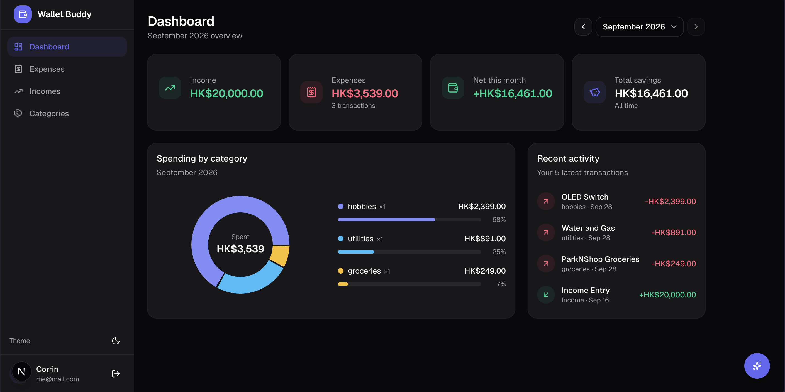
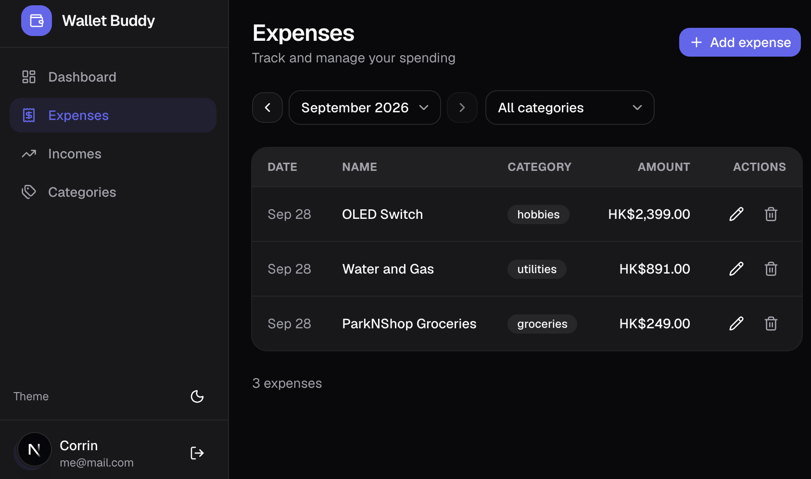
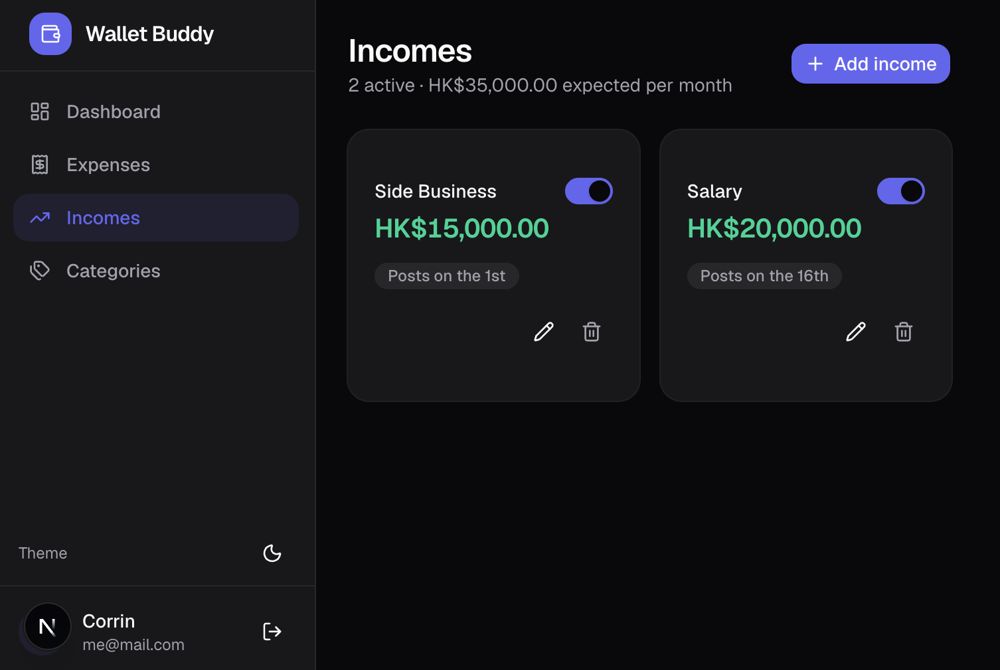
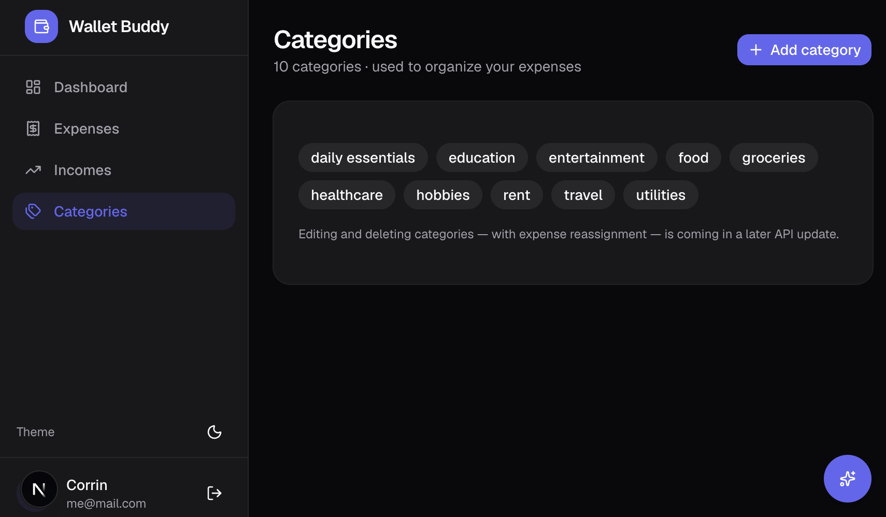
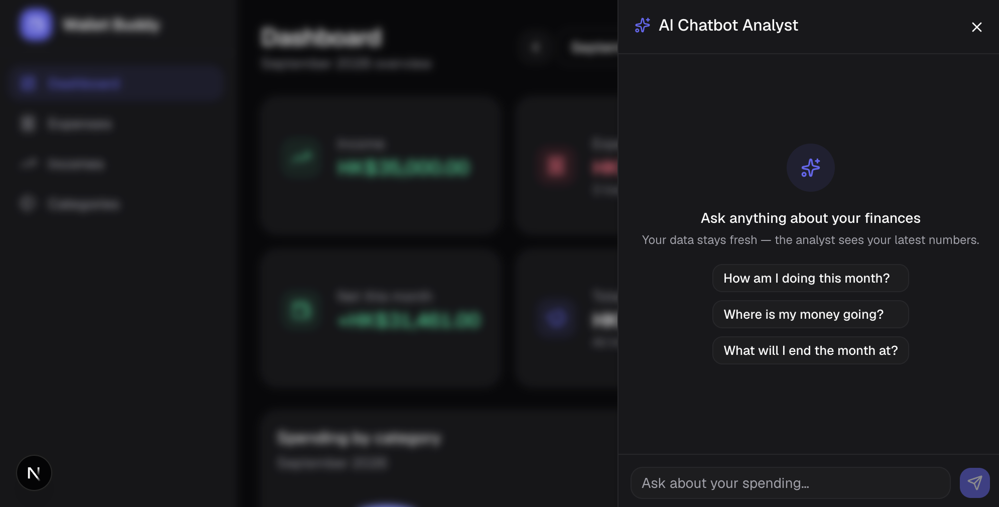

# MyWallet - Production-Ready Personal Expense Tracker API with Chatbot Analyst

This is MyWallet, a self-hosted personal finance tracker with a built-in AI analyst. Log expenses and recurring income, visualize monthly spending, and ask a locally hosted language model questions about your own data, with deterministic, fully tested numbers underneath.

[](LICENSE)
[](https://nodejs.org)
[](CONTRIBUTING.md)

<!-- Enable once CI and coverage reporting are set up:
[](https://github.com/ESPChong/personal-expense-tracker-with-chatbot-analyst/actions)
[](https://codecov.io/gh/ESPChong/personal-expense-tracker-with-chatbot-analyst)
-->

## Table of Contents

- [Live Demo](#live-demo)
- [Screenshots](#screenshots)
- [Features](#features)
- [Tech Stack](#tech-stack)
- [Architecture Overview](#architecture-overview)
- [Getting Started](#getting-started)
- [Environment Variables Reference](#environment-variables-reference)
- [Scripts Reference](#scripts-reference)
- [Testing, Linting, and Type Checking](#testing-linting-and-type-checking)
- [API Documentation](#api-documentation)
- [Deployment and Operations](#deployment-and-operations)
- [Roadmap](#roadmap)
- [Contributing](#contributing)
- [License](#license)

## Live Demo

- Production: (not yet deployed)
- Staging: (not yet deployed)
- API documentation (Swagger UI): (link placeholder)
- Demo account credentials: (placeholder)

## Screenshots

<!-- Replace with real screenshots. Suggested location:
     docs/screenshots/ -->

### Dashboard



### Expenses



### Incomes and Categories




### AI Analyst



### Demo Video

_Placeholder: link to a short walkthrough covering registration, adding an expense,
and asking the analyst a question._

## Features

- **Session-based authentication.** HTTP-only cookies, bcrypt password hashing, and
  server-side session records stored as SHA-256 hashes. Login and registration are
  rate limited per email and per IP.
- **Expense tracking.** Full CRUD with pagination, month and category filters, and
  strict per-user ownership isolation on every query.
- **Recurring income.** Income templates post automatically each month. Postings never
  predate a template's creation, missing periods are back-filled, and the dashboard
  read endpoint is a pure read with no side effects.
- **Dashboard analytics.** Monthly summary (income, expenses, net, all-time savings),
  spending breakdown by category, recent activity, and run-rate month-end projections
  with confidence grading.
- **AI analyst.** A locally hosted model (Ollama) answers questions about your data
  using a hybrid design: a pre-computed context snapshot plus whitelisted, user-scoped
  tools. All amounts are pre-converted before the model sees them, and if the model
  server is unreachable the endpoint degrades to a deterministic summary instead of
  failing. Daily per-user message limit.
- **Money handling.** All amounts are stored as integer minor units (cents). Display
  currency is configurable and defaults to HKD.
- **Dark and light themes**, responsive layout, and empty, loading, and error states
  throughout.
- **A documented REST API** (OpenAPI 3.0) and a deterministic test suite requiring no
  network access and no running language model.

## Tech Stack

| Layer        | Technology                                                                                                                                                   |
| ------------ | ------------------------------------------------------------------------------------------------------------------------------------------------------------ |
| Frontend     | Next.js 16 (App Router), React 19, TypeScript, Tailwind CSS v4, shadcn/ui, TanStack Query, react-hook-form with zod resolvers, Recharts, next-themes, sonner |
| Backend      | Next.js Route Handlers (REST), zod request validation, custom session authentication                                                                         |
| Database     | MongoDB with Prisma ORM                                                                                                                                      |
| AI / LLM     | LangChain core primitives with a custom ReAct tool loop, Ollama for local inference (default model: qwen2.5:7b-instruct)                                     |
| Testing      | Vitest, mongodb-memory-server (in-memory replica set)                                                                                                        |
| Code quality | ESLint 9 (flat config), Prettier, Husky with lint-staged pre-commit hooks                                                                                    |

### Key Design Decisions

- **Money as integer minor units, everywhere.** No floating-point amounts are ever
  persisted. Conversion to display strings happens exactly once, at the boundary
  (UI formatters, and the chatbot context builder so the model only ever sees
  pre-converted figures it can quote verbatim).
- **Deterministic math, language-shaped output.** Totals, projections, and percentage
  splits are computed in TypeScript. The language model selects tools and phrases
  answers; it never performs arithmetic that users rely on.
- **GET endpoints are pure reads.** Recurring income postings are materialized on
  login and on expense/income mutations, never during dashboard reads.
- **Graceful degradation.** If the model server is down, the chatbot endpoint returns
  a deterministic summary built from live data with an explicit `mode` field, rather
  than an error.

## Getting Started

### Prerequisites

- **Node.js 20 or later** (with npm).
- **MongoDB 6.0 or later**, running as a **replica set**. This is required because user
  registration uses Prisma transactions, which MongoDB only supports on replica sets.
  A single-node replica set is sufficient. MongoDB Atlas clusters qualify out of the
  box. For a local standalone instance, enable replication and initiate it once:

  ```js
  // mongosh, after adding replication.replSetName to your mongod config and restarting
  rs.initiate();
  ```

- **Ollama (optional)** for the AI analyst. Recommended model: `qwen2.5:7b-instruct`
  (about 5 GB on disk; 16 GB of RAM recommended). Without Ollama, the application runs
  normally and the chatbot operates in offline summary mode.

### Installation

```bash
# 1. Clone the repository
git clone https://github.com/ESPChong/personal-expense-tracker-with-chatbot-analyst.git
cd expense-tracker

# 2. Install dependencies (prisma generate runs automatically via postinstall)
npm install

# 3. Create your environment file
cp .env.example .env

# 4. Apply the database schema (collections and unique indexes)
npm run db:push

# 5. (Optional) Load demo data
npm run db:reset:seed
#    Demo login: dev@example.com / devpassword123 (dev-only credentials)

# 6. (Optional, for the AI analyst) Start Ollama and pull the model
ollama pull qwen2.5:7b-instruct
ollama serve

# 7. Start the development server
npm run dev
```

The app is now running at `http://localhost:3000`. Register an account (or use the
seeded demo account) to begin.

## Environment Variables Reference

| Variable                 | Required | Scope                | Default                  | Description                                                                                     |
| ------------------------ | -------- | -------------------- | ------------------------ | ----------------------------------------------------------------------------------------------- |
| `DATABASE_URL`           | Yes      | Local and production | none                     | MongoDB connection string. Must point to a replica set.                                         |
| `NEXT_PUBLIC_CURRENCY`   | No       | Local and production | `HKD`                    | ISO 4217 currency code used for all display formatting and the chatbot context.                 |
| `OLLAMA_BASE_URL`        | No       | Local                | `http://localhost:11434` | Base URL of the Ollama server.                                                                  |
| `CHATBOT_MODEL`          | No       | Local                | `qwen2.5:7b-instruct`    | Model name passed to Ollama.                                                                    |
| `CHATBOT_LLM_DISABLED`   | No       | Local and test       | unset                    | Set to `true` to force the chatbot into offline summary mode without stopping the model server. |
| `CHATBOT_DAILY_LIMIT`    | No       | Local and production | `50`                     | Chatbot messages per user per UTC day.                                                          |
| `LOGIN_RATE_LIMIT_EMAIL` | No       | Local and production | `10`                     | Failed login attempts per email per 15-minute window.                                           |
| `LOGIN_RATE_LIMIT_IP`    | No       | Local and production | `30`                     | Login attempts per IP per 15-minute window.                                                     |
| `REGISTER_RATE_LIMIT_IP` | No       | Local and production | `10`                     | Registrations per IP per 15-minute window.                                                      |

Example `.env`:

```bash
# Required
DATABASE_URL="mongodb://localhost:27017/expense-tracker?replicaSet=rs0&directConnection=true"

# Optional: AI analyst
OLLAMA_BASE_URL="http://localhost:11434"
CHATBOT_MODEL="qwen2.5:7b-instruct"
# CHATBOT_LLM_DISABLED="true"

# Optional: rate limits (defaults shown)
# CHATBOT_DAILY_LIMIT=50
# LOGIN_RATE_LIMIT_EMAIL=10
# LOGIN_RATE_LIMIT_IP=30
# REGISTER_RATE_LIMIT_IP=10

# Optional: display currency (ISO 4217)
# NEXT_PUBLIC_CURRENCY=HKD
```

Notes:

- Never commit `.env`. Real secrets belong only in your hosting platform's
  environment configuration.
- The test suite does not read your `.env` database URL for its data: tests boot an
  in-memory MongoDB replica set and refuse to run against any other target.

## Scripts Reference

| Command                                          | Description                                                         |
| ------------------------------------------------ | ------------------------------------------------------------------- |
| `npm run dev`                                    | Start the development server                                        |
| `npm run build`                                  | Create a production build                                           |
| `npm run start`                                  | Serve the production build                                          |
| `npm test`                                       | Run the full test suite (Vitest)                                    |
| `npx vitest`                                     | Run tests in watch mode                                             |
| `npx tsc --noEmit`                               | Type-check the project without emitting output                      |
| `npm run lint`                                   | Run ESLint                                                          |
| `npm run format`                                 | Run Prettier over the repository                                    |
| `npm run db:push`                                | Apply the Prisma schema (collections and indexes) to `DATABASE_URL` |
| `npm run db:reset`                               | Destructive: wipe all data (guarded by an interactive confirmation) |
| `npm run db:reset:seed`                          | Wipe and seed demo data                                             |
| `npm run e2e`                                    | End to end test                                                     |
| `npm run e2e:ui`                                 | End to end test UI                                                  |
| `npm run e2e:report`                             | Show E2E test report                                                |
| `npx tsx scripts/cleanup-retroactive-entries.ts` | Maintenance: remove income postings that predate their template     |

Pre-commit hooks (Husky with lint-staged) run ESLint and Prettier on staged files.

## Testing, Linting, and Type Checking

### Unit and Integration Tests

```bash
npm test
```

The suite runs against an in-memory MongoDB replica set (mongodb-memory-server) with
the Prisma schema pushed before collection, so unique constraints and index-dependent
code paths execute for real. Test files run sequentially because they share one
in-memory database. The first run downloads a MongoDB binary (about 70 MB).

What is covered:

- Authentication: registration (default categories, password hashing, duplicate
  emails), login (case-insensitive email, invalid credentials), logout, session
  lifecycle, and rate limiting on login and registration.
- CRUD and ownership isolation: expenses, incomes, and categories, including
  cross-user access returning 404 and invalid references returning 400.
- Recurring income engine: idempotent posting, the creation-boundary guard (no
  postings before a template existed), back-fill behavior, and the pure-read
  guarantee of the dashboard endpoint.
- Dashboard aggregation: summary totals, category breakdown, activity ordering,
  and projection math with a fixed clock.
- Chatbot: request validation, rate limiting, context assembly, projection,
  tool execution, and the full agent tool loop using a scripted model (no real
  language model is contacted in tests), plus the offline fallback path.

### End-to-End Tests

(Not yet implemented.)

### Linting and Formatting

```bash
npm run lint
npm run format
```

## API Documentation

The complete REST contract, including request and response schemas, error envelopes,
rate-limit behavior, and the chatbot request and response shapes, is specified in the
OpenAPI 3.0 specification (`swagger.yaml`) in the `/docs` folder at the repository root.

Endpoint summary:

| Method             | Path                 | Purpose                                               |
| ------------------ | -------------------- | ----------------------------------------------------- |
| POST               | `/api/auth/register` | Create account (seeds 9 default categories)           |
| POST               | `/api/auth/login`    | Establish a session                                   |
| POST               | `/api/auth/logout`   | Terminate the session (idempotent)                    |
| GET                | `/api/me`            | Current user                                          |
| GET, POST          | `/api/expenses`      | List (paginated, filtered) and create expenses        |
| GET, PATCH, DELETE | `/api/expenses/{id}` | Read, update, delete an expense                       |
| GET, POST          | `/api/incomes`       | List and create recurring income templates            |
| GET, PATCH, DELETE | `/api/incomes/{id}`  | Read, update (including soft stop), delete a template |
| GET, POST          | `/api/categories`    | List and create categories                            |
| GET                | `/api/dashboard`     | Monthly analytics (pure read)                         |
| POST               | `/api/chatbot`       | Ask the AI analyst                                    |

Conventions: all amounts are integer minor units; a 404 means "not found or not
owned by you"; every error uses the envelope `{ success: false, error, details? }`.

## Deployment and Operations

### Building for Production

```bash
npm run build
npm run start        # serves the production build; NODE_ENV=production enables secure cookies
```

Apply the schema to the production database before the first start:

```bash
DATABASE_URL="<production-url>" npx prisma db push
```

### Production Considerations

- **Rate limiting is in-memory.** Limits are enforced per process. For multi-instance
  deployments, replace the store in `src/lib/rateLimit.ts` with a shared counter
  (Redis or a MongoDB collection).
- **The default model is local-only.** Serverless platforms cannot run Ollama. The
  model is created in a single factory function (`createDefaultModel` in
  `src/services/chatbotService.ts`); swap it there for a hosted provider without
  touching any other code. Without a model, the chatbot degrades to offline mode
  and remains functional.
- **Session cleanup is lazy.** Expired sessions are removed when encountered or on
  login. For long-lived deployments, consider a TTL index on `Session.expiresAt`.

### Docker

(Not yet implemented.)

### Docker Compose

(Not yet implemented.)

### CI/CD

(Not yet implemented.)

#### GitHub Actions

(Not yet implemented.)

#### Quality Gates

(Not yet implemented.)

### Database Migrations in Production

(Not yet implemented.)

### Health Checks

(Not yet implemented.)

#### `/api/health`

(Not yet implemented.)

### Staging Environment

(Not yet implemented.)

## Roadmap

- Playwright end-to-end tests over the full stack
- Budgets per category, surfaced to the AI analyst for over-budget analysis
- Chat history persistence across sessions
- Streaming chatbot replies
- Hosted-model deployment path for serverless environments
- Session expiry via MongoDB TTL index
- Category update and delete with expense reassignment
- Per-user currency setting

## License

This project is licensed under the MIT License. See the [LICENSE](LICENSE) file for
details.
